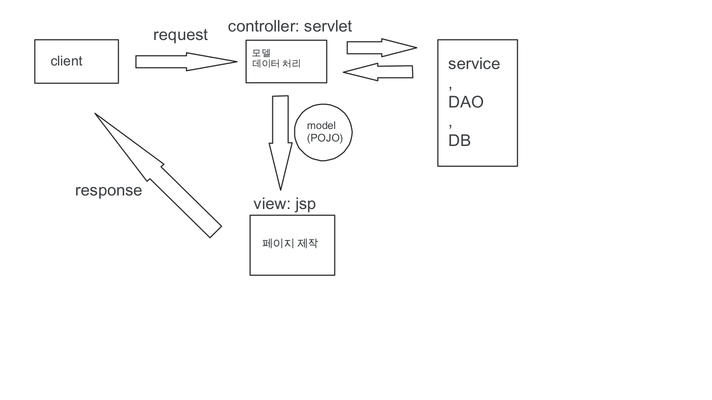

# JSP & Servelt으로 MVC를 구현하는 방법은??
</img>

1. Client가 request보냄.
2. Controller(servlet)가 request를 받고 DB작업을 통해 model을 생성
3. model에 id등을 부여하여 jsp가 해당 모델을 이용할 수 있게한다.
4. `redirect`등을 사용해 jsp가 해당 모델을 갖고 페이지를 생성하도록 한다.

## 출처, 참고
* [youtube: telusko](https://youtu.be/MDHj4vgKY6Q)
## 생각해보기
* _model을 전달할때 어떤 방식으로 모델을 식별하고 저장하는것이 효율적일까?_
* _프레임워크를 사용하지않을때 `redirect`말고 다른방법이 있을까?_
* _직접 MVC를 구현할 때 보다 Spring을 사용할때 편리해지는 부분들_
